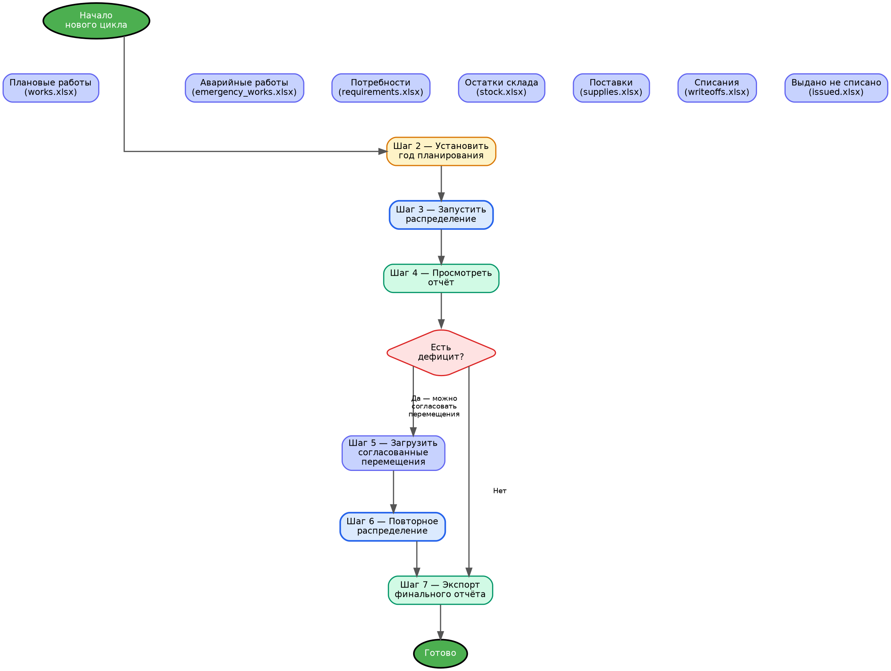
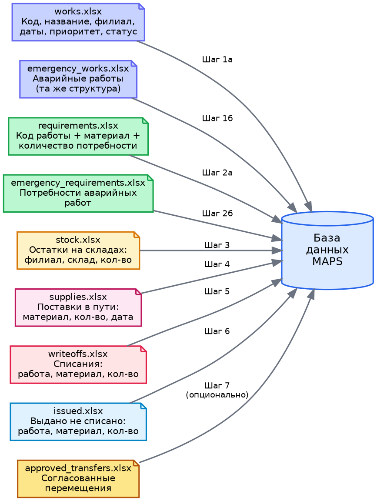
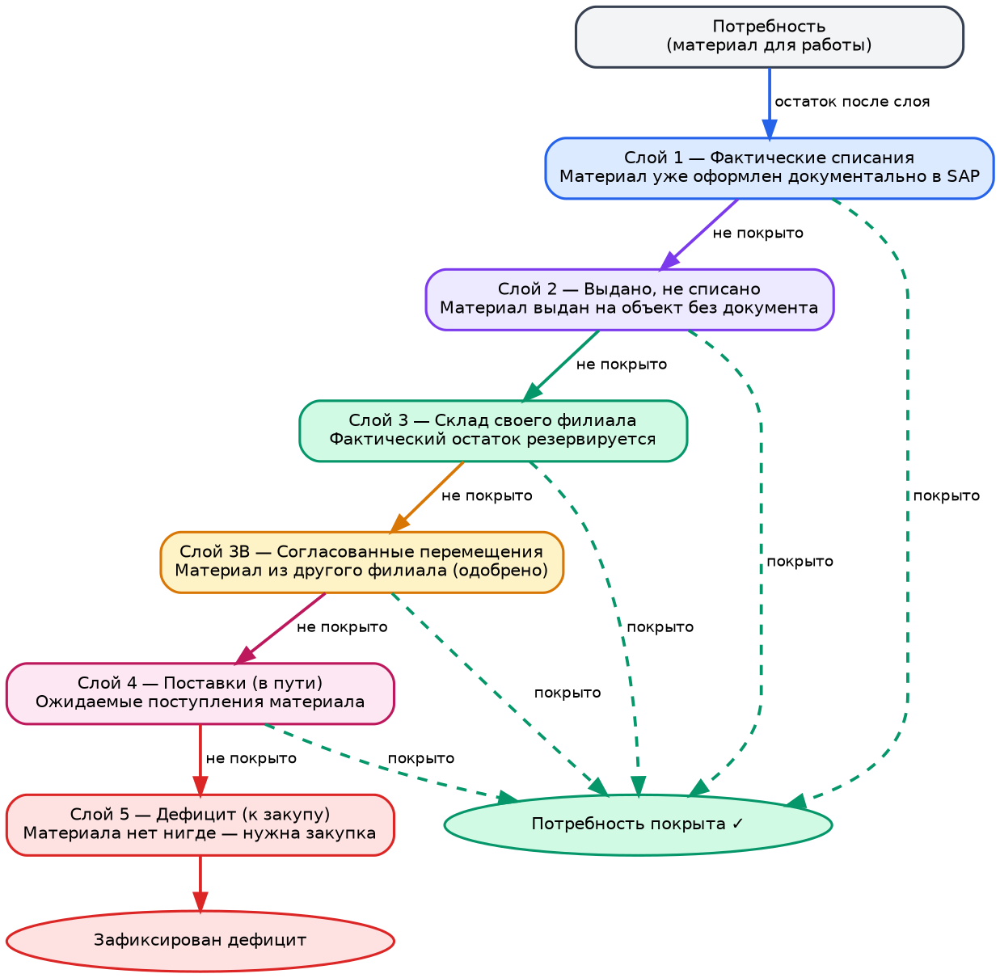
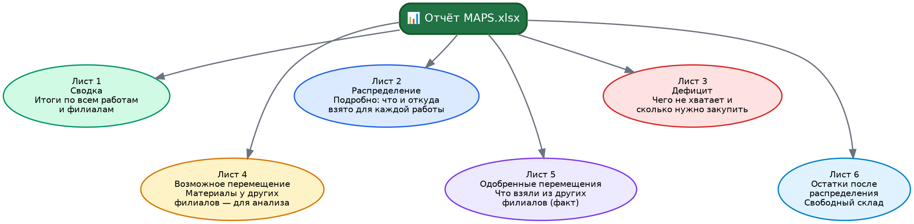

# MAPS — Руководство пользователя

**Система управления материально-техническим обеспечением**  
Автоматическое распределение материалов по строительно-монтажным работам

---

## Содержание

1. [Что такое MAPS и зачем он нужен](#1-что-такое-maps-и-зачем-он-нужен)
2. [Главный экран дашборда](#2-главный-экран-дашборда)
3. [Общий рабочий цикл](#3-общий-рабочий-цикл)
4. [Шаг 1 — Подготовка файлов](#4-шаг-1--подготовка-файлов)
5. [Шаг 2 — Загрузка данных в систему](#5-шаг-2--загрузка-данных-в-систему)
6. [Шаг 3 — Настройка года планирования](#6-шаг-3--настройка-года-планирования)
7. [Шаг 4 — Запуск распределения](#7-шаг-4--запуск-распределения)
8. [Шаг 5 — Анализ результатов](#8-шаг-5--анализ-результатов)
9. [Шаг 6 — Согласование перемещений](#9-шаг-6--согласование-перемещений)
10. [Шаг 7 — Экспорт финального отчёта](#10-шаг-7--экспорт-финального-отчёта)
11. [Структура Excel-отчёта](#11-структура-excel-отчёта)
12. [AI-анализ дефицитов](#12-ai-анализ-дефицитов)
13. [Типичные вопросы и ошибки](#13-типичные-вопросы-и-ошибки)

---

## 1. Что такое MAPS и зачем он нужен

**MAPS** (Material Allocation & Planning System) — система автоматического распределения материалов по строительно-монтажным работам.

### Задача, которую решает MAPS

Представьте ситуацию: у компании десятки филиалов, сотни активных работ, тысячи позиций материалов на складах по всей стране. Каждая работа требует определённые материалы в определённом количестве. На складе этих материалов может быть достаточно, мало или вообще не быть.

Вопросы, на которые нужно ответить:
- Какие работы полностью обеспечены материалами?
- Каких материалов не хватает и сколько нужно докупить?
- Можно ли закрыть дефицит перемещением с другого филиала?
- Что будет поставлено по уже оформленным заявкам?

Вручную на это уходят дни. MAPS делает это за несколько минут.

### Что даёт система

- **Автоматическое распределение** — система сама определяет, какой материал, с какого склада и в каком количестве направить на каждую работу
- **Выявление дефицита** — точный список того, чего не хватает и в каком количестве
- **Анализ перемещений** — находит материалы на складах других филиалов, которые могут закрыть дефицит
- **Приоритизация** — аварийные работы и высокоприоритетные получают материалы в первую очередь
- **Excel-отчёт** — готовый документ для закупщиков, начальников филиалов и руководства

---

## 2. Главный экран дашборда

После входа в систему открывается главный экран — дашборд MAPS.

### Панель статуса (верхняя часть)

Четыре карточки показывают текущее состояние базы данных:

| Карточка | Что показывает |
|----------|---------------|
| **Работы** | Количество загруженных плановых и аварийных работ |
| **Потребности** | Общее число позиций материалов по всем работам |
| **Остатки** | Количество загруженных записей об остатках на складах |
| **Последнее распределение** | Дата и итоги последнего запуска |

### Панель управления (центральная часть)

Здесь расположены:
- Поле **«Год планирования»** — определяет, какие работы считаются активными
- Кнопка **«Запустить распределение»** — запускает алгоритм
- Кнопка **«Скачать отчёт»** — экспортирует результаты в Excel

### Панель импорта (правая часть)

Блоки для загрузки каждого из восьми типов файлов.

### Панель результатов (нижняя часть)

Таблица последних сессий распределения с итоговыми цифрами.

---

## 3. Общий рабочий цикл

Работа с MAPS состоит из чётких шагов. Ниже показана общая схема:

Цикл можно выполнять однократно (шаги 1–4–7) или в два прохода:
- **Первый проход** — получить полную картину дефицита
- **Второй проход** — учесть согласованные перемещения и уточнить результат

Подробнее о двух проходах — в разделе 9.

---

## 4. Шаг 1 — Подготовка файлов

Перед загрузкой необходимо подготовить файлы из SAP. Всего нужно до 9 файлов в формате Excel (`.xlsx`).

### Схема файлов

### Описание каждого файла

---

#### Плановые работы — `works.xlsx`

Список всех плановых строительно-монтажных работ.

| Колонка | Описание | Пример |
|---------|----------|--------|
| Код работы | Уникальный идентификатор работы | ТО-2025-001 |
| Наименование работы | Описание работы | Замена трубопровода |
| Тип работы | Категория: ТО, Ремонт, Монтаж | ТО |
| Филиал | Филиал компании | 1.Актау |
| Завод | Код завода в SAP | KZ01 |
| Дата начала | Дата старта работы | 15.03.2025 |
| Дата окончания | Срок завершения | 30.06.2025 |
| Приоритет | 1 — высший, 2 — средний, 3 — низший | 1 |
| Статус | active / completed / cancelled / on_hold | active |

> **Важно по статусу:** только работы со статусом `active` участвуют в распределении. Завершённые, отменённые и приостановленные — пропускаются.

---

#### Аварийные работы — `emergency_works.xlsx`

Та же структура, что у плановых работ. Аварийные работы имеют наивысший приоритет — материалы для них резервируются в первую очередь.

---

#### Потребности плановых работ — `requirements.xlsx`

Список материалов, необходимых для каждой плановой работы.

| Колонка | Описание | Пример |
|---------|----------|--------|
| Код работы | Ссылка на работу из works.xlsx | ТО-2025-001 |
| Системный номер | Код материала в SAP | 210012345 |
| Наименование материала | Описание материала | Фланец стальной Ду100 |
| Количество | Сколько единиц нужно | 12,000 |
| Ед.изм | Единица измерения | шт |

---

#### Потребности аварийных работ — `emergency_requirements.xlsx`

Та же структура. Загружается отдельно от плановых потребностей.

---

#### Остатки на складах — `stock.xlsx`

Фактические остатки материалов на складах всех филиалов.

| Колонка | Описание | Пример |
|---------|----------|--------|
| Системный номер | Код материала | 210012345 |
| Наименование материала | Описание | Фланец стальной Ду100 |
| Филиал склада | Филиал | 1.Актау |
| Склад | Код склада | 41AR |
| Количество | Остаток | 45,000 |
| Стоимость за ед | Средняя цена | 3500,00 |

---

#### Поставки (материалы в пути) — `supplies.xlsx`

Материалы, которые уже заказаны и ожидаются к поступлению.

| Колонка | Описание | Пример |
|---------|----------|--------|
| Системный номер | Код материала | 210012345 |
| Филиал | Кому придёт поставка | 1.Актау |
| Склад назначения | Код склада | 41AR |
| Количество | Ожидаемое количество | 100,000 |
| Ожидаемая дата | Дата прихода | 15.04.2025 |

---

#### Фактические списания — `writeoffs.xlsx`

Материалы, которые уже были документально оформлены и списаны на конкретные работы в SAP.

| Колонка | Описание |
|---------|----------|
| Код работы | На какую работу списано |
| Системный номер | Какой материал |
| Количество | Сколько уже списано |

---

#### Выдано, не списано — `issued.xlsx`

Материалы, которые физически выданы на объект, но документ ещё не оформлен.

| Колонка | Описание |
|---------|----------|
| Код работы | На какую работу |
| Системный номер | Какой материал |
| Количество | Сколько выдано |

---

#### Согласованные перемещения — `approved_transfers.xlsx` *(опционально)*

Заполняется на втором цикле после анализа результатов первого распределения. Подробнее в разделе 9.

---

### Требования к формату файлов

> Все файлы принимаются в **русском формате**:
> - Дата: **ДД.ММ.ГГГГ** (например, `28.05.2026`)
> - Числа: разделитель дробной части — **запятая** (например, `1234,56`)
> - Формат файла: **Excel (.xlsx)**

---

## 5. Шаг 2 — Загрузка данных в систему

### Порядок загрузки

Файлы загружаются строго по порядку:

1. Плановые работы (`works.xlsx`)
2. Аварийные работы (`emergency_works.xlsx`)
3. Потребности плановых работ (`requirements.xlsx`)
4. Потребности аварийных работ (`emergency_requirements.xlsx`)
5. Остатки на складах (`stock.xlsx`)
6. Поставки (`supplies.xlsx`)
7. Фактические списания (`writeoffs.xlsx`)
8. Выдано, не списано (`issued.xlsx`)

> **Важно:** загрузка плановых работ (`works.xlsx`) автоматически очищает всю базу данных. Это сделано специально — каждый цикл начинается с чистого листа, без накопленных данных прошлых запусков.

### Как загрузить файл

1. В правой панели дашборда найдите нужный блок (например, «Плановые работы»)
2. Нажмите **«Выбрать файл»** или перетащите файл в область загрузки
3. Дождитесь сообщения об успешной загрузке
4. В сообщении будет показано количество загруженных записей

### Что означает результат загрузки

| Показатель | Значение |
|------------|----------|
| created | Новых записей создано |
| errors | Строк с ошибками (пропущены) |
| skipped | Пропущено (например, дубли) |

Если поле `errors` не ноль — проверьте формат файла: правильные ли названия колонок, нет ли пустых обязательных полей.

---

## 6. Шаг 3 — Настройка года планирования

### Зачем нужен год планирования

Алгоритм должен понимать, какие работы считать **активными**, а какие — **завершёнными**. Работа считается завершённой, если её дата окончания раньше 1 января года планирования.

**Пример:** если установлен год `2025`, то работы с датой окончания до 01.01.2025 считаются завершёнными и не получают материалы со склада.

> Это особенно важно при работе с данными прошлого года. Например, если анализируете данные 2025 года в 2026-м — установите год `2025`, иначе система посчитает все работы завершёнными и распределения не произойдёт.

### Как установить год

1. Найдите поле **«Год планирования»** над кнопкой «Запустить распределение»
2. Введите нужный год (например, `2025`)
3. Нажмите **«Сохранить»**
4. Появится зелёная отметка **«Сохранено»**

---

## 7. Шаг 4 — Запуск распределения

### Что происходит при запуске

После нажатия кнопки **«Запустить распределение»** система:

1. Сбрасывает результаты предыдущего распределения
2. Загружает все данные в память
3. Обрабатывает каждую потребность через 5 слоёв алгоритма
4. Сохраняет результаты в базу данных

### Алгоритм распределения — 5 слоёв

Для каждой пары «работа + материал» алгоритм последовательно проверяет источники покрытия:

Алгоритм останавливается на том слое, где потребность закрывается полностью. Если ни один слой не покрыл потребность — фиксируется дефицит.

### Как работает приоритизация

Потребности обрабатываются не в случайном порядке, а по приоритету:

1. **Аварийные работы** — всегда первыми
2. **Плановые работы** — по приоритету (1 → 2 → 3), внутри приоритета — по дате начала (более ранние первыми)

Это значит: если материала на складе хватает только на часть работ, он достанется тем, у кого выше приоритет.

### Ожидание результата

- Распределение запускается **в фоне** — страница не зависает
- Прогресс отображается в виде индикатора
- Типичное время: **1–3 минуты** (зависит от объёма данных)
- После завершения карточки статуса обновятся автоматически

---

## 8. Шаг 5 — Анализ результатов

После завершения распределения на дашборде отображается сводка последней сессии:

| Показатель | Что означает |
|------------|-------------|
| **Потребностей** | Всего обработано позиций «работа + материал» |
| **Распределено** | Потребностей, покрытых хотя бы частично |
| **Дефицит** | Потребностей, не покрытых ни одним источником |

### Что делать с результатами

**Если дефицит нулевой** — все потребности покрыты. Экспортируйте отчёт (раздел 10).

**Если дефицит есть** — это нормально. Следующий шаг — открыть отчёт и проверить лист «Возможное перемещение»: возможно, часть дефицита можно закрыть материалами из других филиалов без новой закупки.

---

## 9. Шаг 6 — Согласование перемещений

Это необязательный, но важный шаг для сокращения дефицита.

### Суть двух циклов

### Что такое «Возможное перемещение»

В отчёте первого распределения есть лист **«Возможное перемещение»** — он показывает, что у других филиалов есть нужный материал, который **можно** переместить для закрытия дефицита.

> Это только **аналитика** — система не распоряжается чужими складами автоматически. Требуется согласование руководства.

### Порядок согласования

1. Откройте Excel-отчёт первого распределения
2. Перейдите на лист **«Возможное перемещение»**
3. Отберите строки, которые руководство одобрило к переброске
4. При необходимости скорректируйте столбец **«Кол-во согласовано»**
5. Сохраните отобранные строки в отдельный файл `approved_transfers.xlsx`

### Структура файла согласований

| Колонка | Что заполнить |
|---------|--------------|
| Системный номер | Код материала (из листа «Возможное перемещение») |
| Склад-источник | Код склада, с которого берём |
| Филиал-получатель | Филиал, которому передаём |
| Кол-во согласовано | Согласованное количество |

### Как загрузить согласования

1. В панели импорта найдите блок **«Согласованные перемещения»**
2. Загрузите файл `approved_transfers.xlsx`
3. Запустите распределение повторно

> После загрузки согласований при повторном распределении система учтёт эти перемещения как реальный источник материалов. Остатки склада-источника уменьшатся, дефицит получателя — сократится.

---

## 10. Шаг 7 — Экспорт финального отчёта

### Как скачать отчёт

1. Нажмите кнопку **«Скачать отчёт»** на дашборде
2. Браузер автоматически скачает файл `MAPS_Отчет_ДАТА_ВРЕМЯ.xlsx`
3. Откройте файл в Excel

---

## 11. Структура Excel-отчёта

Отчёт содержит несколько листов, каждый — для определённой аудитории:

---

### Лист «Сводка»

**Для кого:** руководители, начальники филиалов

Итоговая таблица по каждой работе: сколько потребностей, сколько покрыто, дефицит в штуках и деньгах.

| Колонка | Описание |
|---------|----------|
| Код работы | Идентификатор работы |
| Филиал | Принадлежность работы |
| Всего потребностей | Общее число позиций материалов |
| Покрыто | Покрытых позиций |
| Дефицит (позиций) | Не покрытых позиций |
| Сумма дефицита | Оценочная стоимость нехватки |

---

### Лист «Распределение»

**Для кого:** снабженцы, складские работники

Детальная строка по каждой паре «работа + материал»: что взято, откуда, сколько стоит.

| Колонка | Описание |
|---------|----------|
| Код работы | Работа |
| Системный номер | Материал |
| Источник | Откуда взято: склад, поставка, списание и т.д. |
| Склад | Конкретный склад-источник |
| Кол-во | Распределённое количество |
| Средняя цена | Цена за единицу |
| Сумма | Итоговая стоимость |

---

### Лист «Дефицит»

**Для кого:** закупщики

Список позиций, которые нужно срочно закупить.

| Колонка | Описание |
|---------|----------|
| Приоритет | Приоритет работы (1 — высший) |
| Аварийная | Да / Нет |
| Код работы | Для какой работы |
| Нужно к дате | Срок |
| Системный номер | Код материала |
| Наименование | Название материала |
| Дефицит | Сколько нужно докупить |
| Средняя цена | Ориентировочная цена |
| Оценочная сумма | Стоимость закупки |

> **Совет:** список отсортирован по приоритету — вверху самые срочные позиции: сначала аварийные работы, затем по приоритету и дате.

---

### Лист «Возможное перемещение»

**Для кого:** руководство, снабженцы

Материалы, которые есть на складах других филиалов и могут закрыть часть дефицита. Используется для принятия решения о согласовании перемещений (см. раздел 9).

| Колонка | Описание |
|---------|----------|
| Код работы | Какой работе нужен материал |
| Филиал работы | Филиал-получатель |
| Системный номер | Материал |
| Склад-источник | Откуда можно взять |
| Филиал склада | Чей склад |
| Возможное кол-во | Сколько можно взять |
| Оценочная сумма | Стоимость |

---

### Лист «Одобренные перемещения»

**Для кого:** склады-источники, логисты

Результат второго цикла: что фактически было взято из других филиалов в ходе согласованных межфилиальных перемещений.

---

### Лист «Остатки после распределения»

**Для кого:** складские работники, снабженцы

Свободные остатки на складах после того, как все потребности учтены — то, что не зарезервировано ни под одну из текущих работ.

---

## 12. AI-анализ дефицитов

MAPS включает встроенный AI-ассистент, который помогает разобраться в причинах дефицита.

### Как использовать

1. В разделе дашборда найдите блок **«AI-анализ»**
2. Выберите последнюю сессию распределения
3. Нажмите кнопку **«Объяснить дефицит»**

### Что даёт AI

AI анализирует список дефицитных материалов и отвечает на вопросы:
- Какие материалы наиболее критичны по стоимости и срочности?
- Есть ли закономерности — одни и те же материалы в дефиците по многим работам?
- Что нужно закупить в первую очередь?
- Какие перемещения между филиалами наиболее целесообразны?

> AI не принимает решений и не выполняет действий — он только помогает интерпретировать данные и сформулировать выводы.

---

## 13. Типичные вопросы и ошибки

### Нажал «Запустить распределение», но результат — 0 распределённых

**Причина 1:** не загружены все необходимые файлы.
**Решение:** убедитесь, что загружены как минимум `works.xlsx`, `requirements.xlsx` и `stock.xlsx`.

**Причина 2:** неверно установлен год планирования.
**Решение:** если работаете с данными 2025 года — установите год `2025`, а не текущий.

**Причина 3:** у всех работ статус не `active`.
**Решение:** проверьте файл works.xlsx — в колонке «Статус» должно стоять `active` для работ, которые должны участвовать в распределении.

---

### Ошибка при загрузке файла — «Отсутствуют обязательные колонки»

**Причина:** названия колонок в файле не совпадают с ожидаемыми.
**Решение:** проверьте, что в первой строке файла стоят правильные заголовки согласно разделу 4 этого руководства.

---

### В отчёте есть дефицит, хотя материал точно есть на складе

**Причина 1:** материал числится на складе **другого** филиала. Система не переносит материалы между филиалами без согласования.
**Решение:** используйте лист «Возможное перемещение» и запустите второй цикл с согласованиями (раздел 9).

**Причина 2:** материал зарезервирован под работу с более высоким приоритетом.
**Решение:** повысьте приоритет нужной работы в файле `works.xlsx` и перезапустите импорт и распределение.

---

### Загрузил новые данные, но старые результаты не исчезли

**Объяснение:** полная очистка базы происходит только при загрузке `works.xlsx`. Если загружали другие файлы без него — старые результаты сохраняются.
**Решение:** для полного пересчёта начинайте всегда с загрузки `works.xlsx`, затем остальные файлы по порядку.

---

### Отчёт скачивается, но файл пустой или с ошибкой

**Причина:** распределение ещё не запускалось или завершилось с ошибкой.
**Решение:** проверьте карточку «Последнее распределение» на дашборде — должна быть отметка «Завершено». Если статус «Ошибка» — обратитесь к администратору системы.

---

*MAPS v2.0 — Material Allocation & Planning System*
